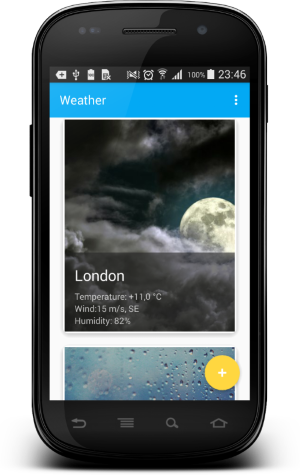
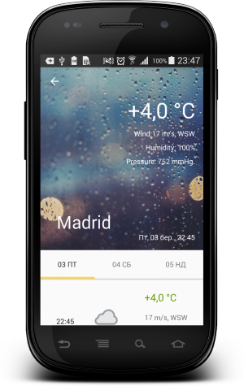
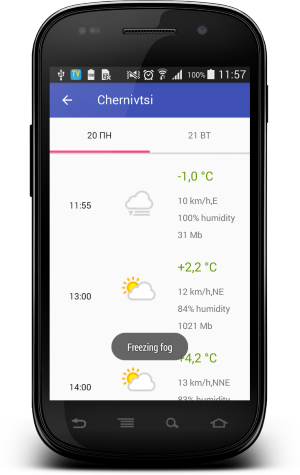
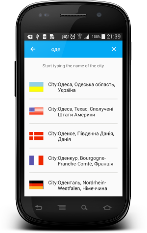
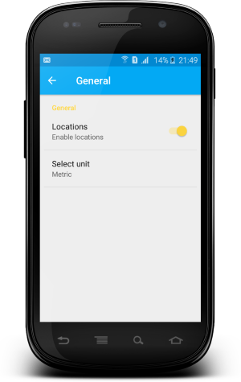
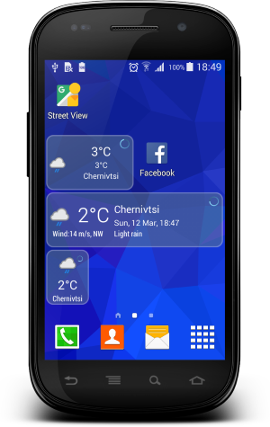

# Weather

  

Weather Android App using apixu API https://www.apixu.com

List of cities and flags from http://www.geonames.org

Icon weather set made by apixu from https://www.apixu.com/api.aspx

Main Activity|Detail Activity | Detail list
-------------|----------------- | -------------
  |  | 

Search City|Settings Activity | Widget
-------------|----------------- | -------------
  |  | 

#### Used libraries:
* com.android.support:appcompat-v7:25.1.0
* com.android.support:support-v4:25.1.0
* com.android.support:recyclerview-v7:25.1.0
* com.android.support:design:25.1.0
* com.android.support:cardview-v7:25.1.1
* org.greenrobot:greendao:3.2.0
* com.squareup.retrofit2:retrofit:2.1.0
* com.squareup.retrofit2:converter-gson:2.1.0
* com.squareup.okhttp3:logging-interceptor:3.3.1
* com.google.android.gms:play-services-location:10.2.0
* com.firebase:firebase-jobdispatcher:0.5.2
* com.facebook.fresco:fresco:1.1.0

Developed By
-------
Igor Havrylyuk (Graviton57)

[1]: https://github.com/graviton57/weather.git
